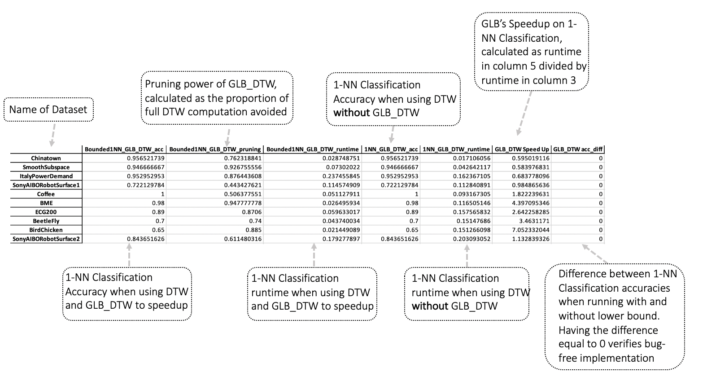

# GLB: A Generalized Lower Bound for Accelerating Similarity Search Under Elastic Time-Series Distance Measures

Generalizable Lower Bounding (GLB) is a framework for developing tight and efficient Lower Bounds (LB) for elastic measures in time series analysis. GLB variants outperform state-of-the-art LBs for all elastic measures.


<figure>

<figcaption align = "center"><b>Comparison of GLB variants against existing LBs on speedup over 128 UCR datasets. Blue circles above the diagonal indicate datasets over which GLB wins.</b></figcaption>
</figure>


This package includes implementation of GLB variants as well as state-of-the-art lower bounds used as baselines to showcase the performance of GLB. The primary purposes of this package is to (1) open-source the code for experiments in the GLB paper to facilitate replication of results and (2) provide our impelementation of existing LBs and GLB to facilitate  further research and application in the community. 


# Publication
"GLB: A Generalized Lower Bound for Accelerating Similarity Search Under Elastic Time-Series Distance Measures"

John Paparrizos, Kaize Wu, Aaron Elmore, Christos Faloutsos, and Michael J. Franklin

under submission/review

# Dataset
Our experiments are performed on 128 datasets from the [UCR archive](https://www.cs.ucr.edu/~eamonn/time_series_data/), which are included in this package (`UCR2018-New`). The UCR archive includes datasets from various domains and is the largest public collection of labeled time series datasets. Datasets are normalized and split into training and test sets. For datasets with varying lengths and missing values, we resort to [pre-processed versions](https://github.com/johnpaparrizos/UCRArchiveFixes) which used standardized
resampling and interpolation methods to fix these issues. 


# The Experiment File
In our evluation, we tested the performance of 23 LBs on 128 datasets. More specifically, we have three sets of experiments: (1) evaluation of experiments when used alone, which applies to all LBs ; (2) evaluation of lower bounds running in cascades (see below for detailed explaination), which applies to LB\_Improved, LB\_New, and GLB; (3) a breakdown analysis of GLB\_DTW to evaluate the contribution of its three components. 

Results of three sections can all be obtained by running `Exp.py` script with different parameters. When running in the terminal, `Exp.py` takes 2 parameters: the first decides the LB to test, and the second decides the number of datasets to test on. To replicate all our results, use the following command, where `all` indicates all LBs, and `full` indicates all datasets.

```bash
python Exp.py all full
```
To run an selected LB on a selected number of datasets, for example $LB\_Keogh$ on 20 to 40 datasets, use the following command:
```bash
python Exp.py LB_Keogh 20 40
```

See next section for a comprehensive list of LBs implemented and evaluated. 


# Lower Bounds Implemented
| Elastic Measure                     | Lower Bounds     | Note |
|-------------------------------------| -----------------| ----------- |
|Dynamic Time Warping (DTW)           | `LB_Keogh`       |    |
|   DTW                               | `GLB_DTW`        | GLB variant for DTW      |
|   DTW                               | `LB_Kim`         |   |
|   DTW                               | `LB_New`         |        |
|   DTW                               | `LB_Improved`    |         |
|Longest Common Subsequence (LCSS)    | `LB_Keogh_LCSS`  |         |
|       LCSS                          | `GLB_LCSS`       | GLB variant for LCSS    |
|Edit Distance with Real Penaly (ERP) | `LB_Kim_ERP`     |       |
|ERP                                  | `LB_Keogh_ERP`   |         |
|       ERP                           | `GLB_ERP`        |     |
|          ERP                        |`LB_ERP`          |      |
|Move-Split-Merge  (MSM)              |`LB_MSM`          |      |
|            MSM                      |`GLB_MSM`         |    GLB variant for MSM  |
|Sequence Weighted Alignment (SWALE)  |`GLB_SWALE`       |  GLB variant for SWALE    |
|Edit Distance on Real Sequences (EDR)|`GLB_EDR`         |   GLB variant for EDR   |
|Time Warp Edit Distance (TWED)       |`LB_TWED`         |      |
|TWED                                 |`GLB_TWED`        |   GLB variant for TWED  |
|DTW                                  |`Cas_Keogh_GLB`         |   LB_Keogh and GLB_DTW running in a cascade   |
|DTW                                  |`Cas_Keogh_New`         |   LB_Keogh and LB_New running in a cascade   |
|          DTW                        |`Cas_Keogh_Improved`         |  LB_Keogh and LB_Improved running in a cascade     |
|           DTW                       |`Breakdown_QueryData`         |   GLB with query and data depencies but without boundary depency  |
|           DTW                       |`Breakdown_QueryOnly`         |   GLB with query depency but without data or boudary depency  |
|            DTW                      |`Breakdown_QueryBoundary`         |   GLB with  query and boundary dependency but without data dependency  |


# Replicating Our Results
1. Download the package to your machine
2.  Go to this directory and download dependent packages by running the following commands in terminal
```bash
> cd GLB
> pip install -r requirements.txt
```
3. Run the experiment file using python:
```bash
> python Exp.py all full
```
4. The experiments will run automatically and output the results in an excel spreadsheet in current directory. 

**Note**
Running our entire experiments take time. 

We ran our experiments on a linux server with the following configuration: Dual Intel(R) Xeon(R) Silver 4116 (12-corewith 2-way SMT), 2.10 GHz, 196GB RAM. The server ran Ubuntu Linux 18.04.3 LTS (64-bit) and used Python 3.7.5, Numba 0.53.1, and GCC 8.4.0 compiler. It took us more than 7 days to finish all experiments. 

Given limited time, partial results could be obtained by changing `Line 54` of **Experiment files** to change the number of datasets you want to test on.

See the following figure for how to interpret the results:



# Use LBs implemented in this library
To experiment with LBs and Elastic Measures implemented in this package, simply import the two scripts and run correspondng elastic measure/LB as shown in example below, where we compute the DTW distance between two arbitrary time series and use `lb_keogh` and `glb_dtw` to compute the lower boud of DTW distance.

Note that Elastic Measures in `ElasticMeasures.py` and LBs implemented in `LB.py` expect a time series to be formatted as a 1D `numpy` array. 

```python
import numpy as np
import ElasticMeasures
import LB

ts_x = np.array([3, 4, 8, 4, 15, 10, 3, 14])
ts_y = np.array([4, 8, 12, 19, 23, 7, 2, 9])

dtw_dist = ElasticMeasures.dtw(ts_x, ts_y, w = 2)
lb_keogh_dist = LB.lb_keogh(ts_x, ts_y, w = 2)
glb_dtw_dist = LB.glb_dtw(ts_x, ts_y, w = 2)

print("DTW Distance: ", dtw_dist)
print("LB_Keogh Distance: ", lb_keogh_dist)
print("GLB_DTW Distance: ", glb_dtw_dist)
```

Output:
```python
DTW Distance:  11.874342087037917
LB_Keogh Distance:  5.916079783099616
GLB_DTW Distance:  10.344080432788601
```

# Use Elastic Measures and LBs in 1-NN Classification
## Naive 1-NN Search
```python
class Bounded1NN(object):

    def __init__(self, metric, lb = True, constraint = None, w = 1, epsilon = 0.2, m = 0, g = 0.3, c =0.5, lamb =1, nu = 0.0001, timesx = None, timesy = None, p = 5, r = 1):
        self.metric = metric
        self.w = w
        self.epsilon = epsilon
        self.constraint = constraint
        

    def fit(self, X, Xlabel):

        self.X = X
        self.Xlabel = Xlabel
    
    def predict(self, Y):
        pruned = 0
        test_class = np.zeros(Y.shape[0])
        window = self.w * Y.shape[1]
        
        if self.lb == True: 
            for idx_y, y in enumerate(Y):
                best_so_far = float('inf')
                lb_list = np.zeros(self.X.shape[0])
                
                    lb_dist = glb_dtw(x, y, w)

                    lb_list[idx_x] = lb_dist

                ordering = np.argsort(lb_list)

                self.X = self.X[ordering]
                self.Xlabel = self.Xlabel[ordering]
                lb_list = lb_list[ordering]
                
                for idx_x, x in enumerate(self.X):

                    lb_dist = lb_list[idx_x]

                    if lb_dist < best_so_far:

                        if self.metric == "GLB_DTW": 
                            actual_dist = dtw(x, y, window)

                        if actual_dist < best_so_far:
                            best_so_far = actual_dist
                            test_class[idx_y] = self.Xlabel[idx_x]
                    
                    if lb_dist > best_so_far:
                        pruned += 1
                    
        pruning_power = pruned / (Y.shape[0] * self.X.shape[0])
            
        
        return test_class, pruning_power

```


## Use Pre-processing to accelerate 1-NN

```python
class Bounded1NN(object):

    def __init__(self, metric, lb = True, constraint = None, w = 1, epsilon = 0.2, m = 0, g = 0.3, c =0.5, lamb =1, nu = 0.0001, timesx = None, timesy = None, p = 5, r = 1):
        self.metric = metric
        self.w = w
        self.epsilon = epsilon
        self.constraint = constraint
        

    def fit(self, X, Xlabel):

        self.X = X
        self.Xlabel = Xlabel

    def predict(self, Y):
        pruned = 0
        test_class = np.zeros(Y.shape[0])
        window = self.w * Y.shape[1]
        window = matlab_round(window)
        
        if self.lb == True: 
            self.XUE, self.XLE = make_envelopes(self.X, window)
            self.YUE, self.YLE = make_envelopes(Y, window)
            for idx_y, y in enumerate(Y):
                best_so_far = float('inf')
                lb_list = np.zeros(self.X.shape[0])
                
                    lb_dist = glb_dtw(x, y, self.YUE[idx_y], self.YLE[idx_y],  self.XUE[idx_x], self.XLE[idx_x])

                    lb_list[idx_x] = lb_dist

                ordering = np.argsort(lb_list)

                self.X = self.X[ordering]
                self.Xlabel = self.Xlabel[ordering]
                lb_list = lb_list[ordering]
                
                self.XUE = self.XUE[ordering]
                self.XLE = self.XLE[ordering]


                for idx_x, x in enumerate(self.X):

                    lb_dist = lb_list[idx_x]

                    if lb_dist < best_so_far:

                        if self.metric == "GLB_DTW": 
                            actual_dist = dtw(x, y, window, self.constraint)

                        if actual_dist < best_so_far:
                            best_so_far = actual_dist
                            test_class[idx_y] = self.Xlabel[idx_x]
                    
                    if lb_dist > best_so_far:
                        pruned += 1
                    
        pruning_power = pruned / (Y.shape[0] * self.X.shape[0])
            
        
        return test_class, pruning_power
```


### Use LBs for 1-NN Classification
```python
>>> from LB import Bounded1NN
>>> model = Bounded1NN(metric = 'lcss', lb = True)
>>> model.fit(Coffee_train_X, Coffee_train_y)
>>> predicted_label = model.predict(Coffee_test_X)
>>> print('predicted_label: ', predicted_label)

>>> lb_predict:  [0. 0. 0. 0. 0. 0. 0. 0. 0. 0. 0. 0. 0. 0. 0. 0. 0. 0. 1. 0. 0. 0. 0. 0. 0. 0. 0. 0.]
```

